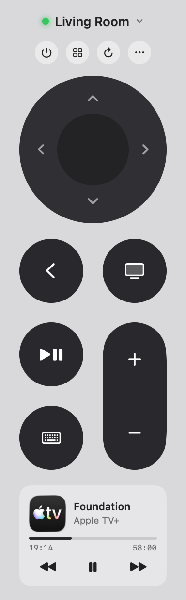

# Clicker

A tiny macOS menu-bar remote for Apple TV — clickpad, app launcher, and
now-playing card, no phone required. For the engineer whose Siri Remote is
forever in the couch cushions.

  

Native SwiftUI, no Electron, and fully self-contained: the
[pyatv](https://pyatv.dev) protocol engine (discovery, PIN pairing,
Companion + AirPlay) ships inside the app.

## What it does

- **Siri Remote layout** you already know: clickpad with arrows, back, TV,
  play/pause, volume rocker, power (wake/sleep)
- **Scroll to navigate** — two-finger scroll or mouse wheel on the remote
  moves the selection, sideways included
- **App launcher** with real App Store artwork and a search field;
  `net⏎` opens Netflix
- **Now-playing card** — artwork, title, progress, and transport controls
  (apps that withhold metadata, like Netflix, fall back to app + play state)
- **Type from your Mac keyboard** — the text field appears automatically
  whenever a text field is focused on the TV
- **Keyboard shortcuts** while the popover is open: arrows navigate,
  ⏎ select, space play/pause, ⌫ back
- Multiple Apple TVs, remembered pairings, auto-reconnect

## Install

Homebrew:

    brew install --cask ribren/tap/clicker

Or by hand: grab `Clicker-macOS.zip` from the
[latest release](https://github.com/ribren/clicker/releases), unzip, and drop
`Clicker.app` into `/Applications`. Signed & notarized, batteries included —
there is nothing else to install.

Then: launch Clicker, allow local-network access when macOS asks, pick your
Apple TV, click **Pair…**, and type the PIN from the TV screen. Optional:
click **Set Up Now Playing…** on the card at the bottom for the second
(AirPlay) pairing that unlocks playback info.

## Build from source

    ./make-app.sh        # builds + signs Clicker.app (Developer ID if present)
    ./notarize.sh        # notarize + staple (needs notary credentials)
    ./build.sh           # dev loop: build + install to /Applications

`make-app.sh` freezes the pyatv engine on first run via
`tools/make-bridge.sh` (needs Python 3.13 — pyatv breaks on 3.14). Source
builds without the frozen engine fall back to a system pyatv (pipx,
Homebrew, or `defaults write info.backpocket.clicker pyatvBinDir <dir>`).
Requires macOS 14+ and Swift 5.9+.

## Notes

- Pairings are per-Apple TV and stored in `UserDefaults`; each protocol
  (Companion for control, AirPlay for now-playing) pairs once.
- tvOS 26 doesn't push playback state to new clients; Clicker nudges it out
  with a playback-queue request. If a card ever looks stale, hit refresh.
- Inspired by [Itsytv](https://itsytv.app). Built on the excellent
  [pyatv](https://pyatv.dev).

## Buy me a coffee

Clicker is free, and it always will be. But if it ever spares you one
full-couch excavation for the physical remote, there's a
**Buy Me a Coffee ☕** item tucked into the ··· menu, and a
[sponsor button](https://github.com/sponsors/ribren) up top. Entirely
optional, deeply appreciated, and roughly the price of pausing the movie
without getting up.

## License

MIT — see [LICENSE](LICENSE). Free as in couch.
